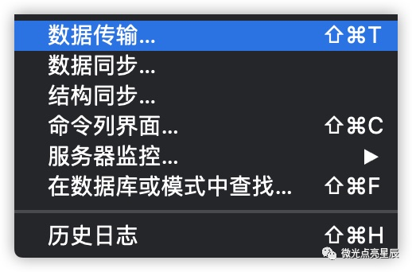
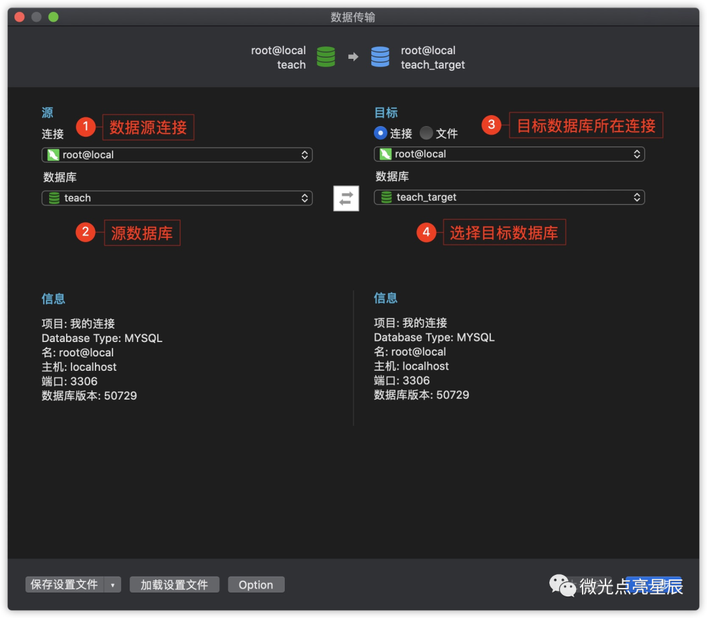
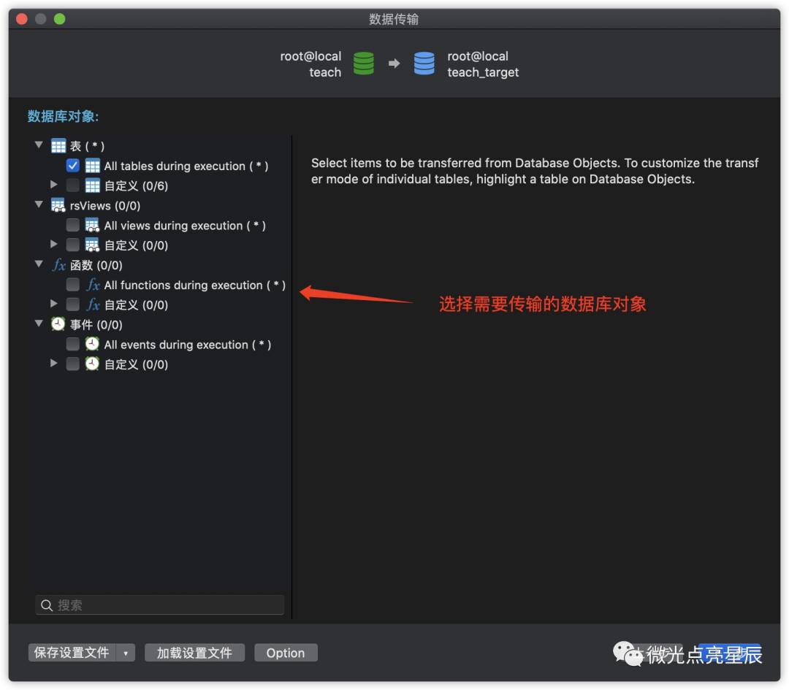
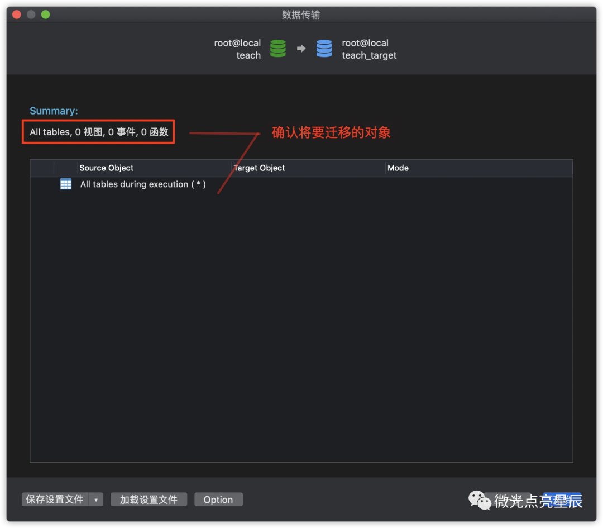
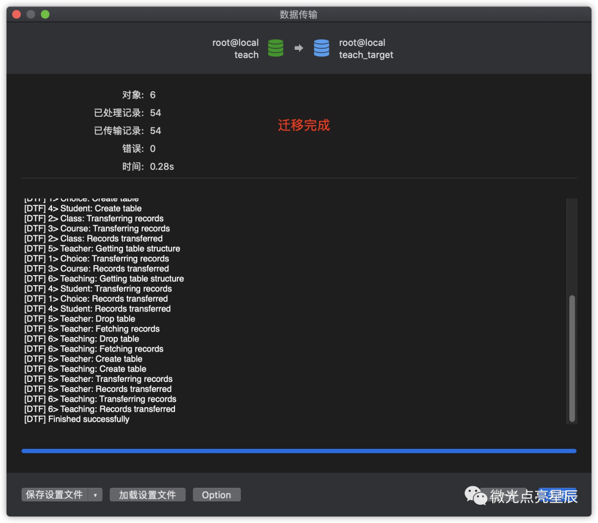
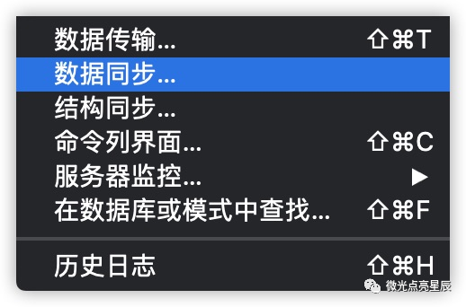
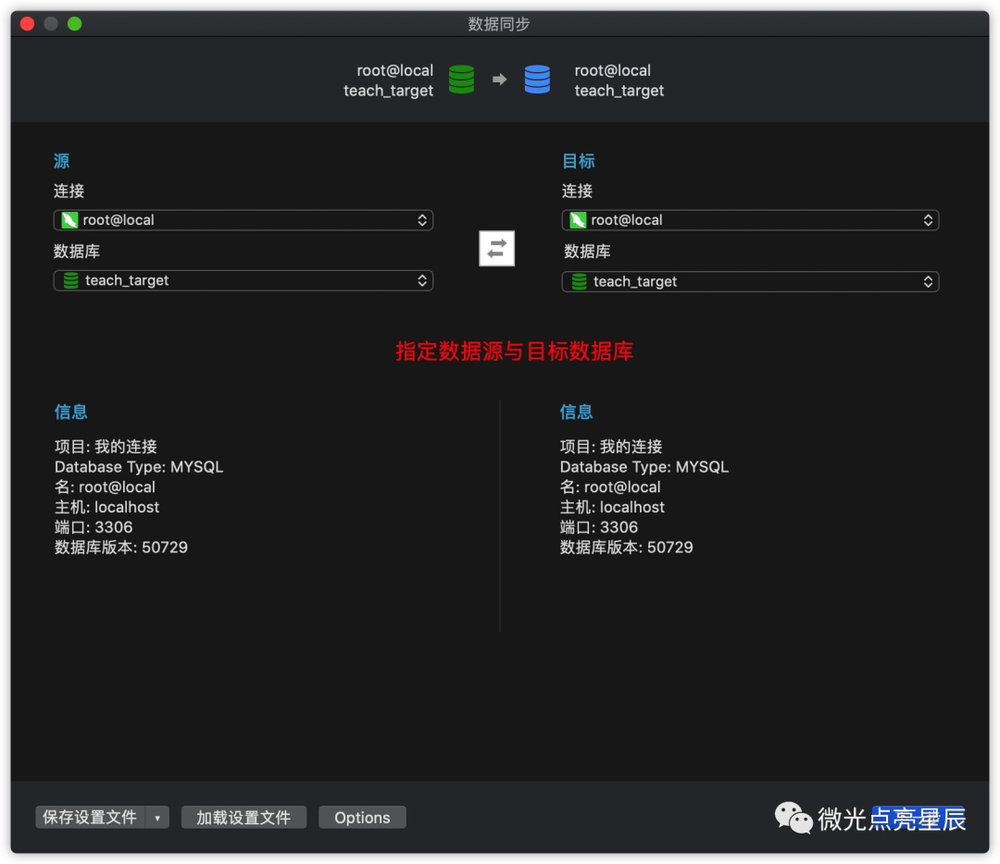
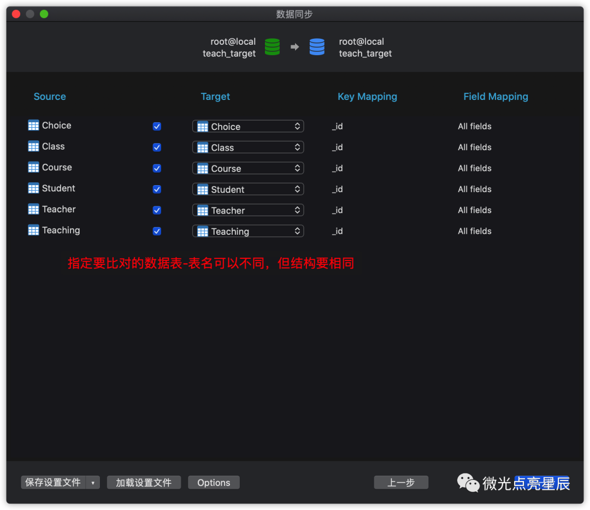
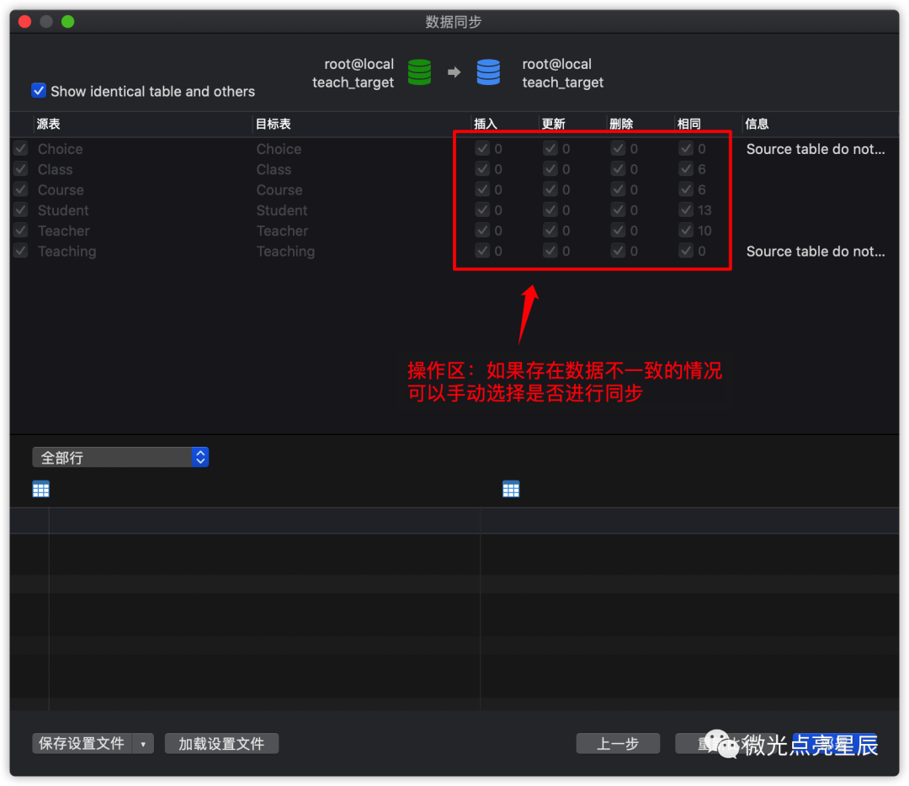
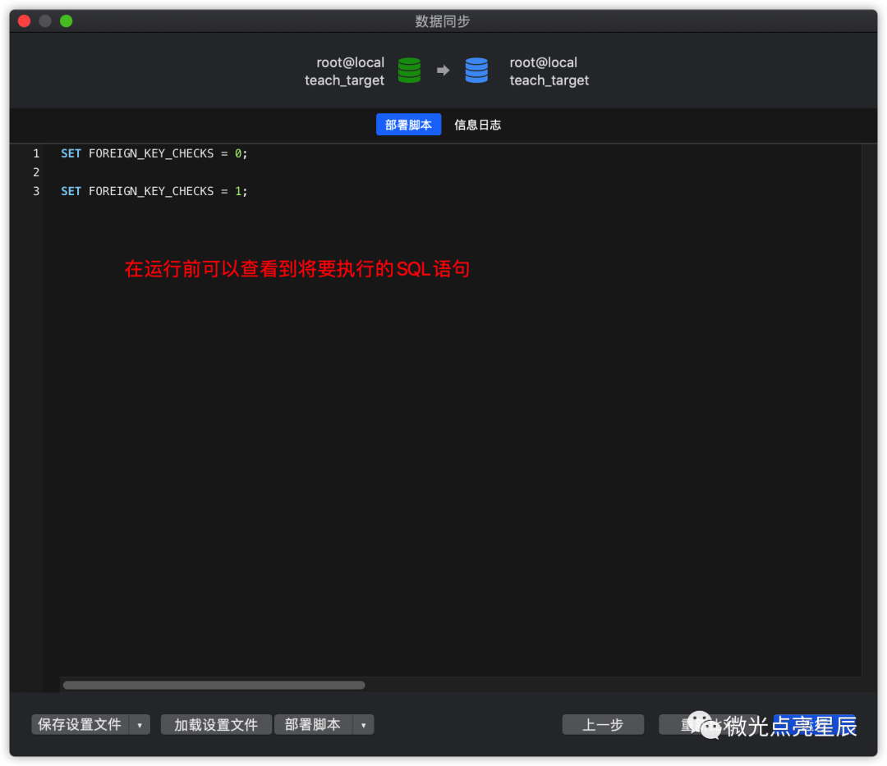

## MySQL迁移

1. 数据传输

   使用数据传输功能的效果与通过SQL语句进行数据导入类似，**一般都会先删除已存在的相同的表**，这一点一定要注意，使得最终结果与数据源相同，完成完整的数据迁移。点击工具菜单中的数据传输开始使用
   
   
   
   
   
2. 数据同步

   数据同步的操作步骤与数据传输类似，同样需要先指定数据源与目标数据库，区别在于数据同步会先比较两个数据库的差异，用户可以自行决定是否进行同步，主要适用于有相同表结构的数据库以及主从分布等场景。
   
   
   
   
   

参考：[数据迁移的几种方式 - MySQL数据库](https://cloud.tencent.com/developer/article/1644917)

## Redis迁移

**Redis-shake介绍**

[Redis-shake](https://github.com/alibaba/RedisShake)是阿里云自研的开源Redis数据传输工具，支持对Redis数据进行解析（decode）、恢复（restore）、备份（dump）和同步（sync或rump），易于部署，灵活高效。Redis-shake的sync（同步）模式支持全量数据迁移和增量数据迁移，详细的迁移流程如下图所示：


1. 安装Redis-shake:

   ```sh
   wget 'http://docs-aliyun.cn-hangzhou.oss.aliyun-inc.com/assets/attach/120287/cn_zh/1608173646665/redis-shake-v2.0.3.tar.gz'
   ```

2. 解压

   ```shell
   tar xzf redis-shake-v2.0.3.tar.gz
   ```

3. 修改配置文件

   ```shell
   cd redis-shake-v2.0.3/ && vim redis-shake.conf
   ```

   | 参数                    | 是否必填 | 说明                                                         | 取值示例                                            |
   | :---------------------- | :------- | :----------------------------------------------------------- | :-------------------------------------------------- |
   | **source.type**         | 是       | 根据源库（自建数据库）的架构选择，取值：standalone：主从架构。cluster：集群架构。 | standalone                                          |
   | **source.address**      | 是       | 源库的连接地址和端口号，连接地址和端口号之间使用英文冒号（:）分隔。**说明**如果源库与Redis-shake部署在同一设备，可填写为`127.0.0.1:6379`。如果源库为集群架构，在填写连接地址时需要添加`master@`前缀，例如`master@127.0.0.1:6379`。 | 127.0.0.1:6379                                      |
   | **source.password_raw** | 是       | 源库的密码，如果源库未设置密码，无需填写。                   | Rp829dlwa                                           |
   | **target.type**         | 是       | 根据目标Redis实例的架构选择，取值：standalone：[标准（主从）架构](https://help.aliyun.com/document_detail/52226.htm#concept-qf3-kjh-tdb)。cluster：[集群架构](https://help.aliyun.com/document_detail/52228.htm#concept-tds-4mm-tdb)。 | standalone                                          |
   | **target.address**      | 是       | 目标Redis实例的连接地址与端口号，连接地址和端口号之间使用英文冒号（:）分隔。关于如何获取连接地址和端口号，请参见[查看连接地址](https://help.aliyun.com/document_detail/107717.htm#concept-apt-fkl-5gb)。ECS实例通过专有网络连接：需获取Redis实例的专有网络连接地址。本地设备通过公网连接：需获取Redis实例的公网连接地址。**说明** 如果目标实例为集群架构，您需要通过直连地址连接（网络类型为专有网络），且在填写连接地址时需要添加`master@`前缀，例如`master@r-bp1mfnrflszg75w****.redis.rds.aliyuncs.com:6379`。关于如何申请直连地址，请参见[开通直连访问](https://help.aliyun.com/document_detail/146901.htm#task-2362225)。 | r-bp1wcw2rlw76acc5k****.redis.rds.aliyuncs.com:6379 |
   | **target.password_raw** | 是       | 目标Redis实例的账号（需具备**读写**权限）及其密码，账号和密码之间使用英文冒号（:）分隔。关于如何创建账号，请参见[创建与管理账号](https://help.aliyun.com/document_detail/92665.htm#task-kth-pr4-hfb)。 | testaccount:Rp829dlwa                               |
   | **target.db**           | 否       | 将源库中所有库的数据都迁移至目标库的指定库中，取值范围为0~15。**说明** 默认值为-1，表示不启用该功能。 | -1                                                  |
   | **key_exists**          | 否       | 当源库中的Key与目标库中的Key相同时，采取的数据写入策略，取值：rewrite：覆盖写入至目标库。none：默认值，停止运行Redis-shake程序并提示冲突的Key。ignore：直接跳过当前迁移的Key，保留目标库的数据，继续执行数据迁移。 | rewrite                                             |

​	观察打印的日志，等待迁移任务进入增量数据迁移状态。

```shell
2020/12/16 21:02:36 [INFO] DbSyncer[0] total = 4.00MB -       2.18MB [ 54%]  entry=52199 
2020/12/16 21:02:36 [INFO] DbSyncer[0] total = 4.00MB -       4.00MB [100%]  entry=97531 
2020/12/16 21:02:36 [INFO] DbSyncer[0] sync rdb done`**说明** 当打印的日志出现`sync rdb done`，表示完成全量数据迁移，接下来进入增量数据迁移阶段。
```

参考：[Redis-shake实现Redis迁移](https://help.aliyun.com/document_detail/111066.html?spm=a2c4g.11186623.6.625.52597ce0BQ1GwU)

## 文件迁移

Linux scp 命令用于 Linux 之间复制文件和目录。

scp 是 secure copy 的缩写, scp 是 linux 系统下基于 ssh 登陆进行安全的远程文件拷贝命令。

scp 是加密的，rcp 是不加密的，scp 是 rcp 的加强版。

```shell
scp -r local_folder remote_username@remote_ip:remote_folder 
```

参考：[Linux scp命令](https://www.runoob.com/linux/linux-comm-scp.html)

