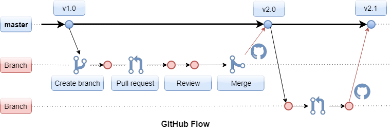

## GitHub flow

GitHub flow是由Scott Chacon于2011年提出的代码分支管理模型，这是GitHub官方推荐的开发流程，以快速部署为目标，目前大部分开源项目都遵循这一流程。

Github flow最大的特点是只有一个长期分支，即主分支master，且主分支始终保持可发布状态。从master上创建新分支进行功能开发、问题修复等，这些分支通过pull request将代码合并到master。为了保证主分支的代码质量，master的权限只开放给一部分人。Pull request是请求别人pull你的代码库（repository），也就是把开发分支的代码经过代码评审并通过测试后，让有权限的管理员合并回master。不过在实际情况中，代码评审不可能检查出提交的代码中的所有问题，所以对于每次提交的代码进行自动化测试，主分支代码的自动化部署尤其重要，自动化测试能在产品部署前及时发现一部分问题，如果产品部署之后发现严重问题，自动化部署可以在最短时间内把产品回滚到上一个版本。
 ​​




Github flow的优点在于流程简单灵活，不需要考虑及管理太多的分支，适用于需要快速集成及“持续发布”的项目，这类项目可能需要每天发布一个版本，甚至一天发布多个版本。但是对于应用场景比较复杂的情况，例如：多个环境下的产品部署，多个版本的发布或问题修复，只有一个master便会显得力不从心。

参考：[代码分支管理](https://www.jianshu.com/p/fc3b3bce5d8a)


## Git合并分支

1. 首先切换到master分支上

```bash
git  checkout master
```

2. 如果是多人开发的话 需要把远程master上的代码pull下来

```bash
git pull origin master
//如果是自己一个开发就没有必要了，为了保险期间还是pull
```

3. 然后我们把dev分支的代码合并到master上

```bash
git  merge dev
```

4. 然后查看状态及执行提交命令

```bash
git status

On branch master
Your branch is ahead of 'origin/master' by 12 commits.
  (use "git push" to publish your local commits)
nothing to commit, working tree clean

//上面的意思就是你有12个commit，需要push到远程master上 
> 最后执行下面提交命令
git push origin master
```

5. 其他命令

```bash
# 更新远程分支列表
git remote update origin --prune

# 查看所有分支
git branch -a

# 删除远程分支Chapater6
git push origin --delete Chapater6

# 删除本地分支 Chapater6
git branch -d  Chapater6
```

参考：[Git合并分支](https://www.jianshu.com/p/26d050497abb)


## Git操作

1. **git commit之后，想撤销commit**

   ```bash
   # 这样就成功的撤销了你的commit 注意，仅仅是撤回commit操作，您写的代码仍然保留。
   git reset --soft HEAD^  # HEAD^的意思是上一个版本，也可以写成HEAD~1 如果你进行了2次commit，想都撤回，可以使用HEAD~2
   
   --mixed 
   意思是：不删除工作空间改动代码，撤销commit，并且撤销git add . 操作 这个为默认参数：git reset --mixed HEAD^ 和 git reset HEAD^ 效果是一样的。
    
   --soft  
   不删除工作空间改动代码，撤销commit，不撤销git add。 
    
   --hard
   删除工作空间改动代码，撤销commit，撤销git add，注意完成这个操作后，就恢复到了上一次的commit状态。
   
   git commit --amend
   顺便说一下，如果commit注释写错了，只是想改一下注释，只需要：此时会进入默认vim编辑器，修改注释完毕后保存就好了。
   ```

   

