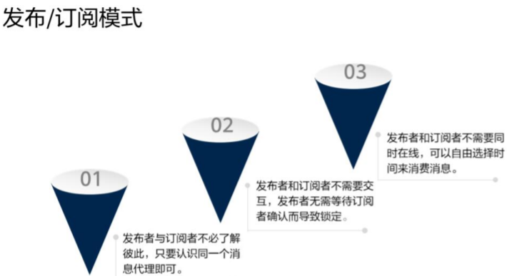

# MQTT协议技术原理

**前言**

机器与机器之间通过请求/回答（Rquest/Response）模式不再适合。取而代之的是发布/订阅（Publish/Subcrine）模式。于是，轻量级、可拓展的MQTT（Message Queuing  Telemetry Transport）消息队列遥感传输协议因运而生。

**简介**

1. 运行在TCP协议栈之上，为其提供有序，可靠，双向连接的网络请求保证。
2. 设计之初目的：
    1. 易于实施和部署
    2. 提供高质量的服务器信息分发功能
    3. 轻量高效低带宽
    4. 数据不可探听（消息加密）
    5. 可持续会话
3. 设计原则：
    1. 精简，不添加可有可无的功能
    2. 发布/订阅模式（Pub/Sub）方便消息在传感器之间传递
    3. 允许用户动态创建主题，零运维成本
    4. 把传输量降到最低以提升传输速率
    5. 把低带宽、高延迟、不稳定的网络因素考虑在内
    6. 支持连续的会话控制
    7. 理解客户端计算能力可能很低
    8. 提供服务质量管理
    9. 假设数据不可知，不强求传输数据的类型与格式，保持灵活性

**发布订阅模式**

### 总结